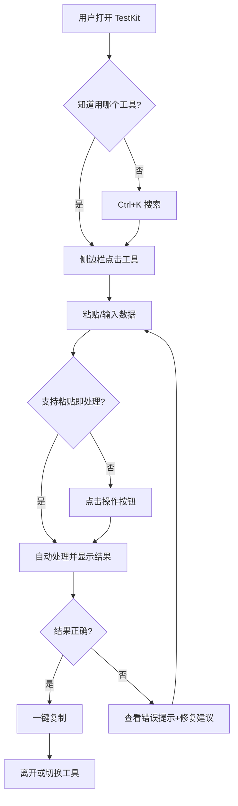

## 1. 产品概述

TestKit 是一款面向全角色测试工程师（手工测试、自动化测试、性能测试、安全测试、测试开发）的在线工具箱网站。提供数据转换校验、日常效率工具和 API 调试功能，即开即用，纯前端零部署，所有数据处理在本地完成，保护隐私。

- 解决测试工程师日常工作中频繁切换工具、重复造轮子的痛点
- 目标：成为测试工程师的"瑞士军刀"，打开即用，用完即走

## 2. 核心功能

### 2.1 用户角色

| 角色 | 使用方式 | 核心权限 |
|------|----------|----------|
| 测试工程师 | 无需注册，直接访问 | 使用所有内置工具 |
| 测试主管 | 无需注册，直接访问 | 使用所有工具 + 分享工具链接给团队 |

### 2.2 功能模块

1. **工具箱主页**：侧边栏导航 + 工具面板，全局搜索，暗色/亮色主题
2. **数据转换与校验工具**：JSON 格式化、正则测试器、Base64 编解码、URL 编解码、时间戳转换、JSON↔YAML 转换、哈希计算器
3. **日常效率工具**：随机数据生成（中国特化）、文本 Diff 对比、字符统计
4. **API 调试工具**：轻量 HTTP 请求构造器，Headers/Body 编辑，响应展示

### 2.3 页面详情

| 页面名称 | 模块名称 | 功能描述 |
|----------|----------|----------|
| 工具箱主页 | 侧边栏导航 | 分类展示内置/外链工具，当前工具高亮，可折叠，搜索过滤 |
| 工具箱主页 | Header | Logo + 全局搜索框 + 主题切换 |
| 工具箱主页 | 工具面板 | 输入区 → 操作按钮 → 输出区，一键复制，输入持久化 |
| JSON 格式化 | 格式化/压缩/校验 | 粘贴即格式化，校验失败显示修复建议 |
| 正则测试器 | 正则匹配 | 实时高亮匹配，常用模板，flags 切换 |
| Base64 编解码 | 编码/解码 | UTF-8 中文支持，文件拖拽编码 |
| URL 编解码 | 编码/解码/参数解析 | URL 参数表格视图 |
| 时间戳转换 | 时间戳↔日期 | 自动检测秒/毫秒级，多时区，当前时间戳实时显示 |
| 随机数据生成 | 中国特化数据 | 手机号/身份证/邮箱/姓名，批量生成，JSON/CSV 导出 |
| Diff 对比 | 文本差异对比 | 双栏输入，差异高亮，统计信息 |
| 字符统计 | 计数/去重/转换 | 实时统计字符/单词/行/字节 |
| JSON↔YAML | 双向转换 | 实时预览，语法高亮 |
| 哈希计算器 | 多算法哈希 | MD5/SHA1/SHA256/SHA512，文本和文件 |
| API 调试 | HTTP 请求 | 方法选择，URL 输入，Headers/Body 编辑，响应展示 |

## 3. 核心流程

用户打开网站 → 侧边栏选择工具（或 Ctrl+K 搜索）→ 粘贴/输入数据 → 自动处理或点击按钮 → 查看结果 → 一键复制 → 离开

## 4. 用户界面设计

### 4.1 设计风格

- **主色**：青绿色 #10B981（科技感+专业感），辅助色深蓝灰 #0F172A
- **按钮风格**：圆角 8px，主色填充，hover 加深，禁用灰色
- **字体**：JetBrains Mono（代码区），Inter（UI 文本）
- **布局风格**：左侧固定侧边栏 + 右侧主内容区，工具面板上下分区
- **图标风格**：Lucide 线性图标，24px，与文字对齐
- **整体风格**：深色主题为主，紧凑信息密度，极简工具箱风格

### 4.2 页面设计概览

| 页面名称 | 模块名称 | UI 元素 |
|----------|----------|---------|
| 工具箱主页 | 侧边栏 | 深色背景 #0F172A，分类标题可折叠，工具项 hover 高亮，外链 ↗ 标记 |
| 工具箱主页 | Header | Logo 青绿色，搜索框圆角，主题切换太阳/月亮图标 |
| 工具箱主页 | 工具面板 | 白/深色背景，CodeMirror 编辑器，操作按钮行，输出区 + CopyButton |
| 工具箱主页 | 空状态 | 灰色占位提示文字 + 示例数据，如 JSON 工具显示示例 JSON |
| 工具箱主页 | 错误状态 | 红色边框输入区 + 红色错误文字 + 修复建议 |

### 4.3 响应式

- 桌面优先（1280px+），侧边栏固定 240px
- 平板（768-1279px），侧边栏可折叠为图标模式
- 手机（<768px），侧边栏隐藏，底部 Tab 栏显示核心工具

### 4.4 设计 Token

**间距系统**（4px 基数）：1=4px, 2=8px, 3=12px, 4=16px, 6=24px, 8=32px

**色彩系统**：
- 暗色：bg-primary=#0F172A, bg-secondary=#1E293B, bg-tertiary=#334155
- 亮色：bg-primary=#FFFFFF, bg-secondary=#F8FAFC, bg-tertiary=#E2E8F0
- 文字：text-primary=#F1F5F9(暗)/#0F172A(亮), text-secondary=#94A3B8(暗)/#64748B(亮)
- 边框：border=#475569(暗)/#CBD5E1(亮)
- 语义：error=#EF4444, success=#10B981, warning=#F59E0B

**排版层级**：
- h1: 20px/700, h2: 16px/600, body: 14px/400, code: 13px/400(JetBrains Mono), caption: 12px/400
