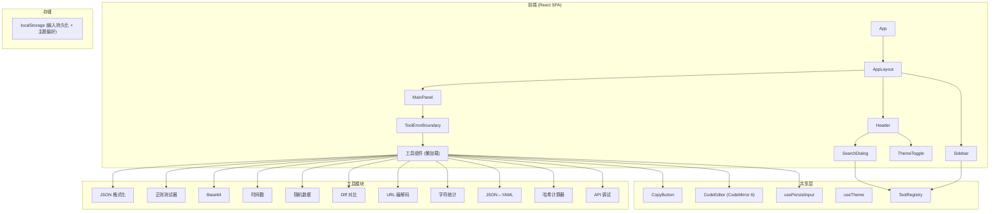

## 1. 架构设计



## 2. 技术说明

- **前端**: React 19 + TypeScript + Tailwind CSS 4 + Vite 6
- **初始化工具**: vite-init (react-ts 模板)
- **后端**: 无（纯前端 SPA）
- **数据库**: 无（localStorage 持久化）
- **状态管理**: Zustand（每个工具独立 store + 全局主题 store）
- **代码编辑器**: CodeMirror 6（轻量 ~200KB，替代 Monaco Editor）
- **路由**: React Router 7
- **图标**: Lucide React
- **Diff 算法**: diff 库
- **哈希**: Web Crypto API (SubtleCrypto)

## 3. 路由定义

| 路由 | 用途 |
|------|------|
| `/` | 重定向到 `/json-formatter` |
| `/:toolId` | 渲染对应工具组件 |

## 4. 数据模型

### 4.1 工具定义模型

```typescript
interface InternalTool {
  type: 'internal'
  id: string
  name: string
  description: string
  icon: ReactNode
  category: 'transform' | 'efficiency'
  component: ComponentType
  keywords: string[]
  placeholder?: string
}

interface ExternalTool {
  type: 'external'
  id: string
  name: string
  description: string
  icon: ReactNode
  category: 'transform' | 'efficiency'
  externalUrl: string
  keywords: string[]
}

type ToolDefinition = InternalTool | ExternalTool
```

### 4.2 localStorage 数据结构

| Key | 值类型 | 说明 |
|-----|--------|------|
| `testkit:theme` | `'light' \| 'dark' \| 'system'` | 主题偏好 |
| `testkit:{toolId}:input` | `string` | 工具输入内容（防抖 300ms 写入，>4MB 跳过） |
| `testkit:sidebar:collapsed` | `'true' \| 'false'` | 侧边栏折叠状态 |

## 5. 项目目录结构

```
src/
├── components/
│   ├── layout/
│   │   ├── AppLayout.tsx
│   │   ├── Sidebar.tsx
│   │   ├── Header.tsx
│   │   ├── SearchDialog.tsx
│   │   └── MobileTabBar.tsx
│   └── shared/
│       ├── CopyButton.tsx
│       ├── CodeEditor.tsx
│       └── ToolErrorBoundary.tsx
├── tools/
│   ├── index.ts
│   ├── json-formatter/
│   │   ├── index.tsx
│   │   ├── store.ts
│   │   └── utils.ts
│   ├── regex-tester/
│   ├── base64/
│   ├── url-encode/
│   ├── timestamp/
│   ├── data-generator/
│   ├── text-diff/
│   ├── char-counter/
│   ├── json-yaml/
│   ├── hash-calculator/
│   └── api-debugger/
├── hooks/
│   ├── useTheme.ts
│   └── usePersistInput.ts
├── lib/
│   └── tool-registry.ts
├── types/
│   └── tool.ts
├── App.tsx
├── main.tsx
└── index.css
```
